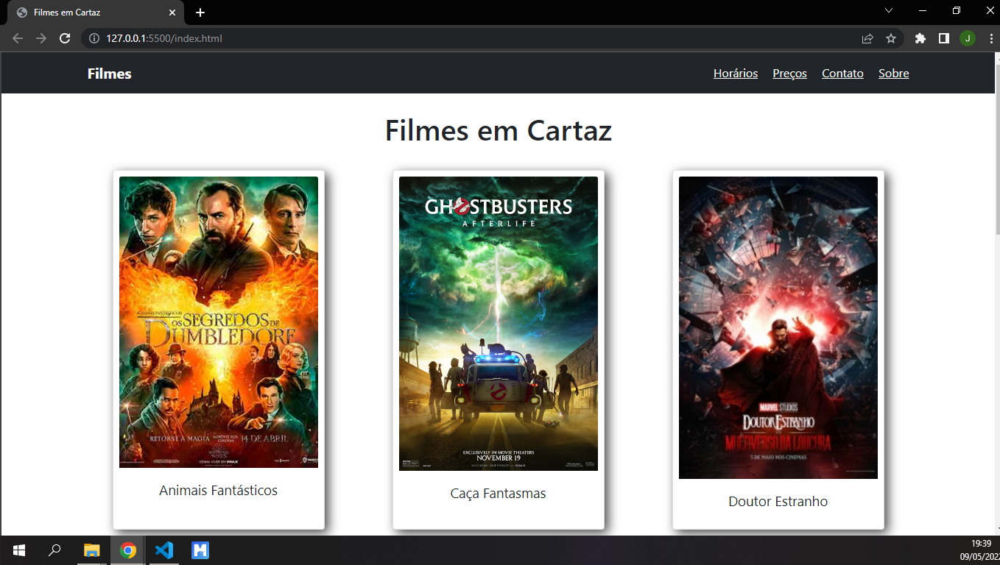
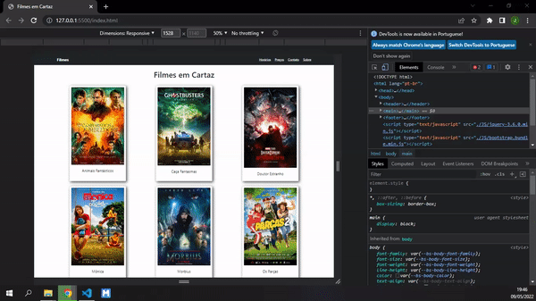

# One Page com Bootstrap

### One page de site onde mostra filmes em cartaz. Projeto realizado no intuito de exercício com os fundamentos do Boostrap, incluindo diretrizes da bibliotéca e totalmente responsivo.

### Projeto realizado junto ao curso B7Web com os ensinamentos do educador Boniek Lacerda.

### Confira o resultado final acessando https://johnerick-dev.github.io/one-page-bootstrap/

## Visualização do site

## Demonstrando responsividade

